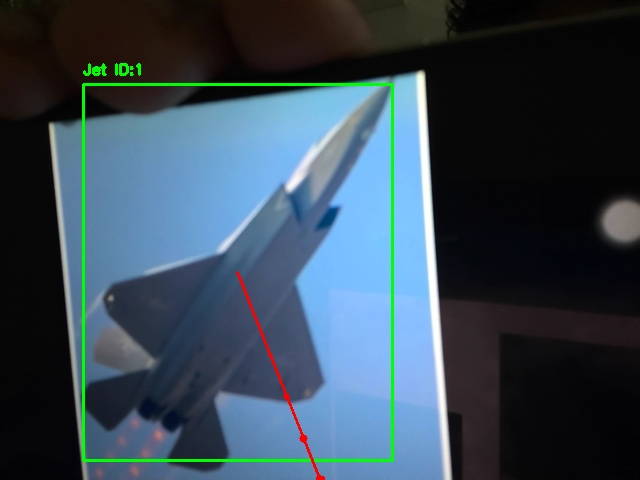
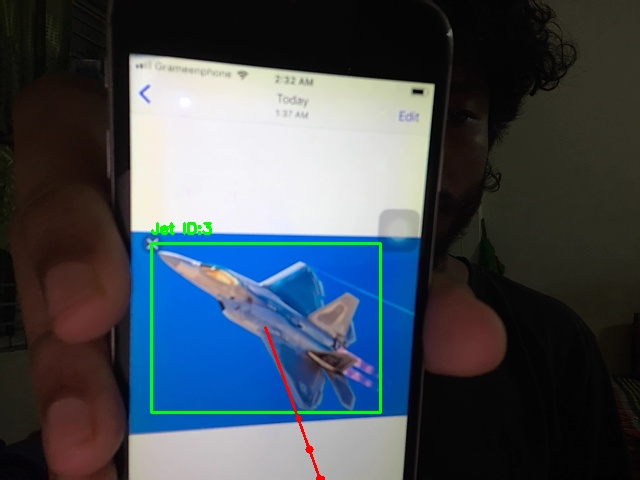
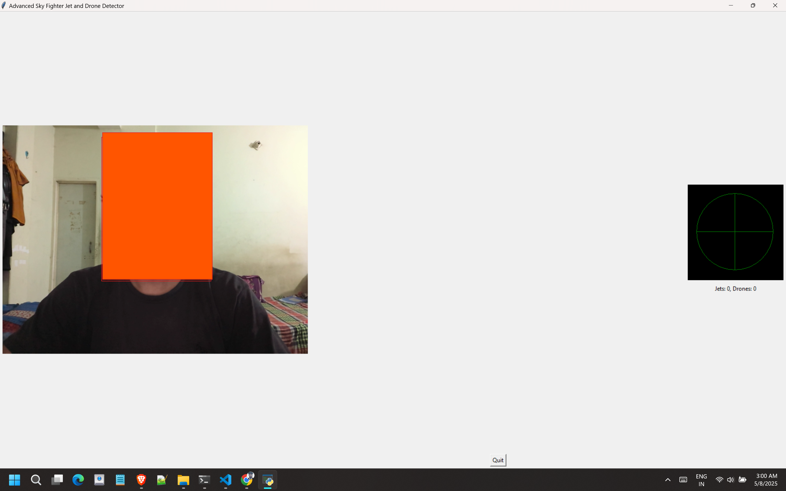

## 🛰️ Advanced Sky Fighter Jet and Drone Detector

A real-time object detection and tracking system that identifies jets and drones in the sky using YOLOv8, the SORT tracking algorithm, and an interactive Tkinter GUI with radar visualization. The system simulates target locking and firing, complete with sound alerts and screenshots of engagements.

---

### 📸 Features

* 🔍 **YOLOv8** object detection (pretrained on COCO)
* 📦 **SORT** multi-object tracking
* 🎯 Target locking and firing simulation with visual laser effects
* 🔔 Sound alert on detection
* 🖼️ Live camera feed and real-time annotation
* 📡 Radar-style GUI panel for detected targets
* 🧠 Classification: Jets (airplanes) and Drones (birds proxy)
* 💾 Saves screenshots of fired targets
* 🪟 Built with Python, OpenCV, and Tkinter

---

### 📁 Folder Structure

```
project/
│
├── sort/                     # SORT tracker module (from GitHub)
│   └── sort.py
├── output/                   # Screenshots of fired targets
├── main.py               # Main script (your code)
├── requirements.txt
└── README.md
```
---
### Detect And  Fire Jets And Drones


---

---

### 🚀 Installation

1. **Clone the repository**:

```bash
git clone https://github.com/shiboshreeroy/sky-fighter-jetand-Fighter-drone-detector.git
cd sky-fighter-jetand-Fighter-drone-detector
```

2. **Set up Python environment** (recommended):

```bash
python -m venv venv
source venv/bin/activate  # On Windows: venv\Scripts\activate
```

3. **Install dependencies**:

```bash
pip install -r requirements.txt
```

4. **Download YOLOv8 model**:
   Make sure `yolov8n.pt` is in your working directory. You can download it from [Ultralytics YOLOv8 Releases](https://github.com/ultralytics/ultralytics/releases).

5. **Add SORT tracker**:
   If not already present, clone the SORT module:

```bash
git clone https://github.com/abewley/sort.git
```

Make sure `sort/sort.py` is accessible to your main script.

---

### 🧠 How It Works

* Uses your webcam (default device) to capture frames.
* Detects jets and drones using YOLOv8 (`yolov8n.pt` model).
* Tracks multiple targets with unique IDs using the SORT algorithm.
* GUI shows:

  * Live video with bounding boxes
  * Radar display of angular position
  * Jets (green/red), Drones (blue)
* Automatically locks and "fires" at the first target, saves image.

---

### 🎮 Controls

* **Quit**: Press the `Quit` button to safely close the app.

---

### ⚠️ Notes

* `winsound` is Windows-only. For Linux/macOS, consider replacing it with `playsound` or `simpleaudio`.
* Tkinter must be installed (comes with standard Python on most systems).
* Uses COCO labels: Airplanes → Jets, Birds → Drones

---

### 📷 Example Screenshot



---

### 🛠️ To-Do / Improvements

* [ ] Cross-platform audio support
* [ ] Use a custom YOLOv8 model trained on real drone/jet data
* [ ] Add keyboard controls for target override
* [ ] Add support for recording video

---

### 📜 License

MIT License – use freely and modify responsibly.
